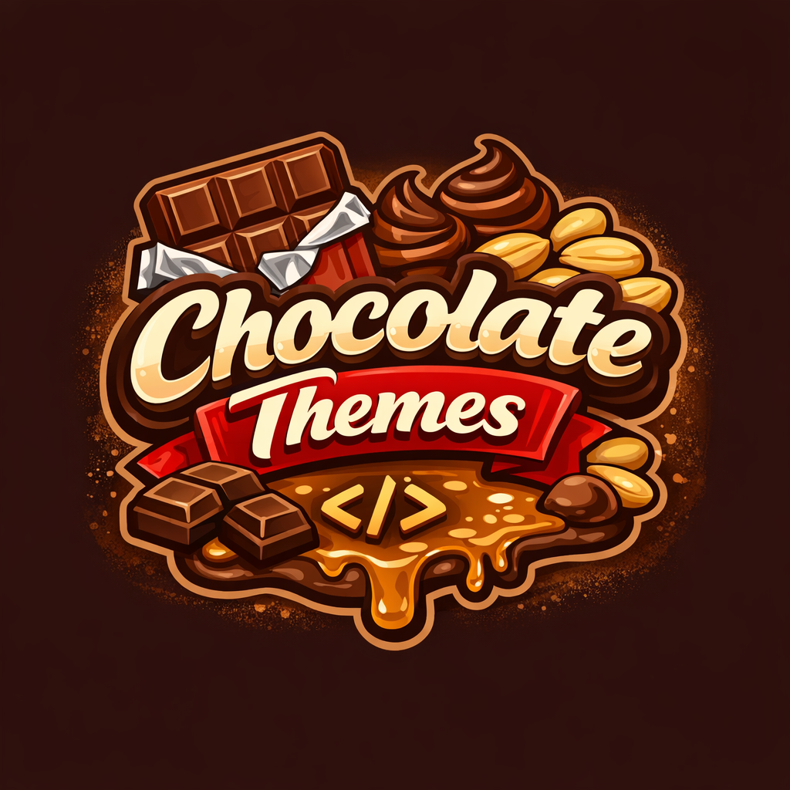
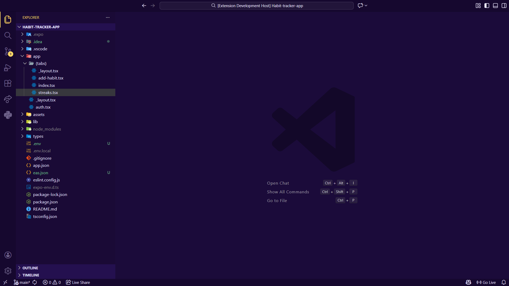
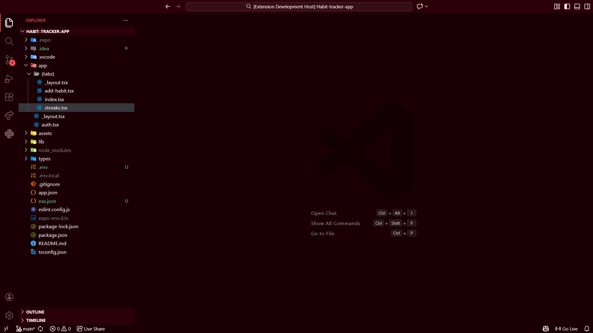
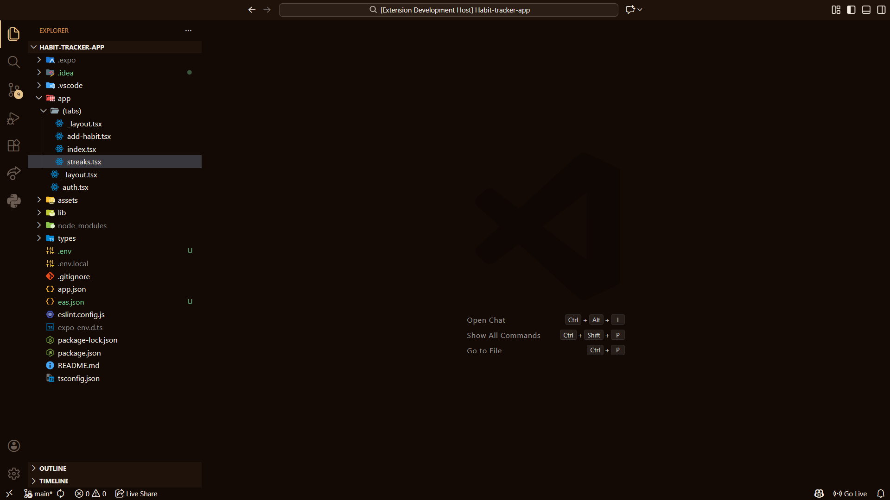

  

<h1 align="center">🍫 Chocolate Themes</h1>

A collection of rich, chocolate-inspired <strong>dark themes</strong> for <strong>Visual Studio Code</strong>, crafted for long coding sessions, visual comfort, and a premium developer experience.

---

## ✨ Included Themes

### 🟣 Chocolate · Dairy Milk Dark
- Deep purple background with golden highlights
- Smooth contrast for long coding hours
- Calm, premium look inspired by Dairy Milk

### 🔴 Chocolate · KitKat Dark
- Bold red and cream color palette
- High contrast and energetic appearance
- Perfect for developers who prefer vibrant themes

### 🟤 Chocolate · Snickers Dark
- Warm chocolate brown with caramel and peanut tones
- Cozy and balanced color scheme
- Easy on the eyes during extended use

---

## 🎨 Features

- Carefully tuned dark color palettes
- Full UI coverage (editor, sidebar, tabs, title bar, terminal, menus)
- Semantic highlighting enabled for modern language servers
- TextMate token support for backward compatibility
- Optimized for long coding sessions
- Works well on both LCD and OLED displays

---

## 🧠 Designed For

- JavaScript / TypeScript
- React, Node.js
- HTML, CSS, JSON
- Markdown
- General programming workflows

---

## 🚀 How to Use

1. Install **Chocolate Themes** from the VS Code Marketplace
2. Open the Command Palette using `Ctrl + Shift + P`
3. Select `Preferences: Color Theme`
4. Choose one of:
   - Chocolate · Dairy Milk Dark
   - Chocolate · KitKat
   - Chocolate · Snickers

---

## 📸 Screenshots

### Chocolate · Dairy Milk Dark

### Chocolate · KitKat

### Chocolate · Snickers

---

## 🛠 Recommended Settings

- Use **Fira Code** or **JetBrains Mono**
- Keep semantic highlighting enabled (default)
- Slightly increase editor font size for long sessions

---

## 📦 Versioning

This extension follows **Semantic Versioning**:

- **PATCH** – small color tweaks and fixes
- **MINOR** – new themes or noticeable improvements
- **MAJOR** – large redesigns or breaking changes

See `CHANGELOG.md` for the full history.

---

## 📜 License

Licensed under the **Apache License 2.0**.

---

## ❤️ Feedback

If you enjoy using **Chocolate Themes**, consider leaving a review on the VS Code Marketplace.
Suggestions and feedback are always welcome!

---

## 🍫 Happy Coding!

Designed with care for developers who love dark themes.
